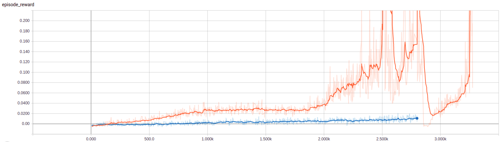
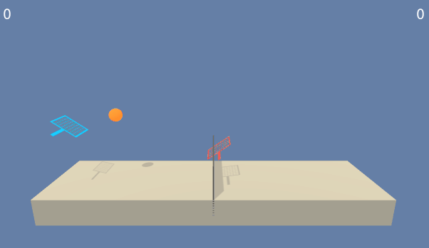
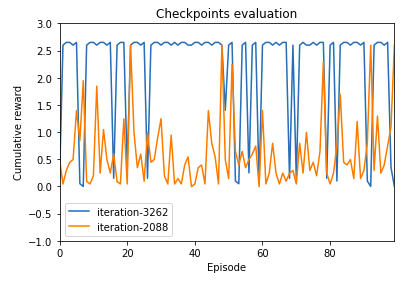

## Solution of the Tennis enviroment



Two training attempts, which differ in algorithm, were done:

* [tennis-multippo.csv](./tennis-multippo-training.csv): Two separate PPO agents are trained simultaneously. Each is fed the state from environment without any modifications.
* [tennis-ppo.csv](./tennis-ppo-training.csv): single-agent version of PPO without any modifications. Environment state is also not modified.

Training was done on 30 simultaneously running Tennis environments.

Proximal Policy Optimization algorithm was used. Key points:
* Both Continuous and Discreete action spaces are supported;
* Implemented [Generalized Advantage Estimation](https://arxiv.org/abs/1506.02438);
* Parallel computation of the GAE using Python `multiprocessing` module;
* Advantage Normalization;
* Whole experience buffer is used as a single batch during optimization stage. That allowed to keep code more simple and worked well on the current environments;

## Main Python files
* Implemetation of the multi-agent PPO is in the [multippo.py](../rl/multippo.py). 
* Implemetation of the single-agent PPO is in the [ppo.py](../rl/ppo.py). 
* Statistics storage and output to TensorBoard [stats.py](../rl/stats.py)
* Adapter for the Unity and OpenAI environments [env.py](../rl/env.py) makes single interface for interacting with them;
* Runner. Runs iterations, evaluation and training phases, single episodes. Combines together other components together. [runner.py](../rl/runner.py)
* Train [train.py](../train.py) and [play.py](../play.py) scripts are input points for training and playing a trained agents.

## Hyperparameters
* Learning rate: 0.0003
* Reward discount (gamma): 0.99
* PPO training epochs: 12
* PPO Epsilon. Defines how far can the optimized policy "go away" from the original policy: 0.2
* Horizon. How many timesteps should experience be collected before starting optimization phase: 500
* Number of simultaneously running environments: 30
* Batch size is equal to the whole buffer size: 30 environments * 500 horizon steps = 15000 samples per batch
* Lambda parameter for Advantage Function Estimation (GAE). This configures the impact of each n-step Advantage estimation into the resulting GAE value: 0.95

## Architecture
Multi-Agent PPO version and Single-agent PPO version don't differ in the network architecture.
Multi-version doesn't do training "itself": it creates multiple single-version PPO agents and works as a "router" to send states from the environment to the appropriate agent.

For the neural network only Fully Connected layers are used. Value head and action networks are completely separated. That makes the algorithm to converge faster and allows to avoid the task of adjusting weights of the Actor and Critic losses.

Critic network:

1. Middleware #1: `state_size` → 128; Leaky ReLU
2. Middleware #2: 128 → 128; Leaky ReLU
3. Value Head: 128 → 1

Actor network:

1. Middleware #1: `state_size` → 128; Leaky ReLU
2. Middleware #2: 128 → 128; Leaky ReLU
3. Action Head: 128 → `action_size`. In case of continuous environment the Tanh activation function is used and output is interpreted as `mu` value of Gaussian distribution. The `sigma` value of the distribution is read from the separate parameter of the network, which doesn't depend on the state.

## Trained agend

The winner, surprisingly, is the single-agent version of the PPO algorithm. It trained faster than all other agents. Following numbers are listed for this version.



After training 2088 iterations the agent reaches target score [XXXXX on 100 episodes](./tennis-ppo-2088-eval.csv). The amount of steps is the same for all iterations, but one iteration can have multiple episode. After training on 3262 iterations agent reaches average score of [2.17 on 100 episodes](./tennis-ppo-3262-eval.csv).



In order to run the trained agend, copy the saved network from the github to the local machine:

```
wget https://github.com/vladhc/rl-udacity/raw/master/p3_tennis/tennis-ppo-3262.pth
```

and then run visualization:

```
python play.py --checkpoint tennis-ppo-3262.pth
```

This renders the environment, runs multiple episodes and outputs the average reward.

## Other thoughts

* This project became more enginering project, rather than research project, because of technical limitations: the Tennis environment didn't run multiple versions "out of the box". I needed simultaneously running environment because PPO is much faster trains on them. In order to achieve that, I had to do a workaround, starting multiple parallel Processes each with it's separate Tennis environment (see [env.py](../rl/env.py) class `ForkedUnityEnv`). This part has taken a lot of time. There is a place for improvement for Udacity, if they would provide the latest version of [UnityEnvironment](https://github.com/Unity-Technologies/ml-agents/blob/master/docs/Python-API.md#loading-a-unity-environment), which correctly processes the `worker_id` parameter. Current version has a bug, which crashes when using this parameter.
* When building the Multi-agent version, I have noticed that the project becomes complex. It could be simplified if the project would be written in functional style instead of object-oriented style, because the functional style seems to be a natural fit for the data processing pipelines. Agents with their environment interactions can be considered as a one data pipeline.

## Ideas for Future work
This project has a lot of places for improvement both from the enginering and from the research parts. Here is a list of "nice to try":

* Find relevant paper regarding Multi-Agent PPO training and implement it;
* Use the RNN for processing the Tennis state, because the environment already outputs the "stacked" last 3 frames;
* Solve the [Soccer Environment](https://youtu.be/Hg3nmYD3DjQ). Single-version of PPO shouldn't work in this environment, so only "real" Multi-agent PPO implementation would solve it;
* Learn more about the functional style of Python programming and design the algorithms in a way of a data-processing-pipeline. This should decrease time spend on development;
* Optimize the simultaneously running Unity environments. Even the environments are running in parallel, there is still a big overhead for inter-process communication. That leads to low utilization of GPU (~2%) and CPUs (~30%);
